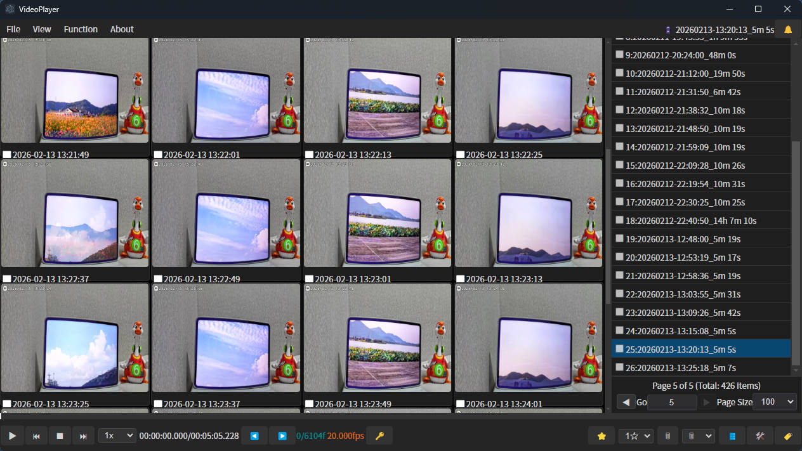
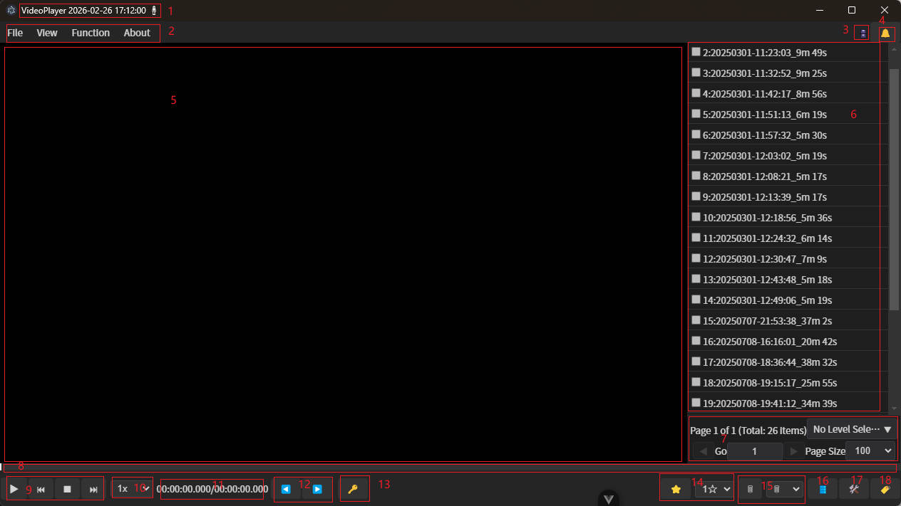
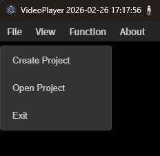
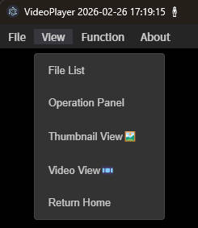
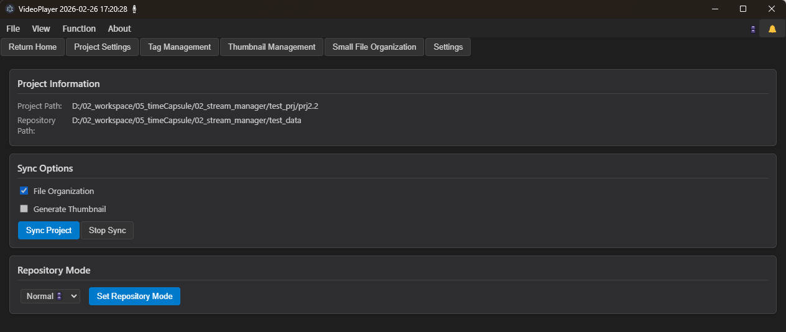

# StreamSeek User Manual

# 1 Introduction

## 1.1 Software Overview

**StreamSeek** (码流探索) is a desktop application specifically designed for security surveillance video file management. The software provides core functions such as fast video retrieval, intelligent classification management, tag annotation, keyframe extraction and storage. Highly suitable for managing Xiaomi camera recording videos. Also supports recording files generated by other cameras.

## 1.2 Design Goals

This system aims to solve common challenges in large-scale recording data management:
- Efficient organization and retrieval of massive video files
- Rapid identification and filtering of valuable content
- Optimized utilization of storage resources
- Automated video processing and analysis

## 1.3 Core Functions

- **Recording Playback Control**: Support standard playback, variable speed playback, precise frame positioning, keyframe preview
- **File Management**: Video file browsing, soft deletion (recycle bin mechanism), batch operations
- **Annotation System**: Video content classification and marking based on tags and ratings
- **Keyframe Processing**: Automatically extract recording keyframes and key recording segments, reducing storage space usage

## 1.4 Applicable Scenarios

- Long-term archiving and management of security surveillance recordings
- Centralized management of smart home device recordings (such as Xiaomi cameras)
- Support MP4 video files with standard naming format (e.g., `00_20260208103944_20260208104539.mp4`)

# 2 System Requirements and Installation

## 2.1 System Compatibility

- Microsoft Windows 10 (64-bit)
- Microsoft Windows 11 (64-bit)

## 2.2 Hardware Requirements

Any normally functioning office computer will suffice.
- CPU: Dual-core processor, clock speed 2.0GHz or higher
- Memory: 4GB RAM (8GB recommended)
- Storage: Sufficient disk space for video file storage

## 2.3 Installation Steps

The system adopts a green installation-free deployment mode, ready to run after decompression.

## 2.4 First Startup Configuration

No additional configuration is required for the first startup. The system will automatically create a default project. Configuration files are stored in the project directory, supporting project reconstruction functionality.

# 3 Quick Start

## 3.1 Interface Overview

- 1 **Status Panel**: Real-time display of system running status
- 2 **Function Navigation Bar**: Provides main operation entries
- 3 **Data View Switch**: Normal warehouse/recycle bin, switching can view normally stored recordings or recordings in the recycle bin. Sometimes low-importance recordings can be deleted when storage space is still available, allowing recording files to be placed in the recycle bin first for later recovery, or when storage space is full, delete some recording files from the recycle bin to free up storage space.
- 4 **Message Center**: Display system notifications and operation feedback
- 5 **Media Preview Area**: Video playback or thumbnail grid display, supporting timeline quick preview
- 6 **File List**: Video file metadata display
- 7 **Pagination Controller**: Large dataset navigation
- 8 **Playback Control Bar**: Video playback progress, key information display
- 9 **Playback Control Buttons**: Basic controls such as play/pause, stop
- 10 **Speed Adjustment**: Playback speed control
- 11 **Time Display**: Current playback time/total duration
- 12 **Frame-by-Frame Navigation**: Precise frame positioning
- 13 **Keyframe Extraction**: Extract keyframes at current playback position
- 14 **Content Rating**: Video importance hierarchical annotation
- 15 **File Deletion**: Support soft deletion and hard deletion operations
- 16 **View Switch**: File list view switching
- 17 **Edit Panel**: Video editing and processing function entry
- 18 **Tag Management**: Video content tag-based management

## 3.2 Create/Open Project

Project creation requires configuring video storage warehouse directory and project working directory. The system will cache the last project path, supporting automatic reconnection.

After creating a project, you need to perform project synchronization operation to import video file metadata into the database and generate preview resources.

## 3.3 Switch Views

- **File List View**: Metadata table display
- **Edit Panel**: Video editing toolset
- **Video Playback View**: Standard player interface
- **Thumbnail View**: Keyframe grid preview, can quickly preview recording content
- **Home**: Return to file management main interface

## 3.4 Standard Operation Flow

## 3.4 Basic Operation Flow

1. **Project Initialization**: Create new project, configure video storage path and project path
2. **Data Synchronization**: Execute project synchronization, record video file information into database, while generating thumbnails and recording keyframe data
3. **Content Management**: Return to main interface for browsing and managing video files
   
**Data Deletion Strategy**:
- Delete in normal mode: File moved to recycle bin, preview resources retained
- Delete in recycle bin mode: Execute physical deletion, optionally clear preview resources

Support video content hierarchical annotation for convenient subsequent batch processing and retrieval.

# 4 Advanced Functions

## 4.1 Video Editing Functions

Support non-linear editing operations such as video segment cropping, merging, splitting, can remove redundant content and retain key segments.

## 4.2 Intelligent Compression Strategy
For low-priority video files, the system can execute keyframe extraction strategy, significantly reducing storage usage while retaining core information. Such files are displayed with special identification in the list, supporting preview mode only.

## 4.3 Batch Processing
Support multi-select video files for batch annotation, deletion, export and other operations, improving work efficiency.

## 4.4 Search and Filter
Provide multi-dimensional search functionality, supporting precise filtering by time range, file size, tags, ratings and other conditions.

# 7. Technical Support

## 7.1 Open Source Project
Project source code hosted on GitHub: `https://github.com/xutopia77/streamseek.git`

## 7.2 Community Support
If you encounter technical issues, please refer to project documentation or submit an Issue.

# 8. Version Information
Current version: 2.2.6
Release date: February 2026

---

*This document last updated: February 2026*