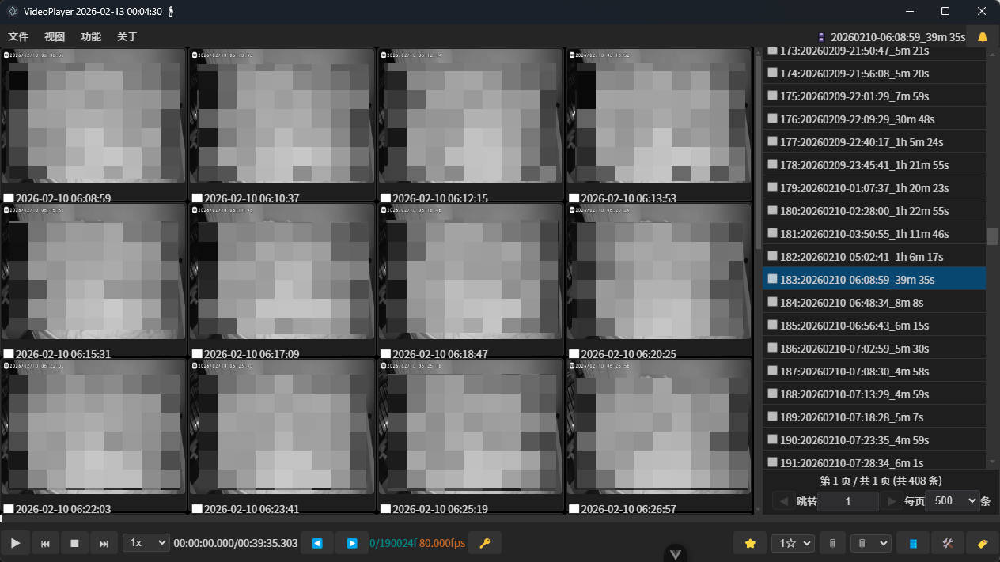

# Video File Management Software User Manual

## 1 Introduction

### 1.1 Software Overview

[Official Website](https://xutopia77.github.io/page/record_manage/)

Record Manager is a desktop application designed for security surveillance video file management. The software provides core functions such as fast video retrieval, intelligent classification management, tag annotation, keyframe extraction and storage. Highly suitable for managing Xiaomi camera recording videos. It also supports recording files from other cameras.

### 1.2 Design Objectives

This system aims to solve common challenges in large-scale recording data management:
- Efficient organization and retrieval of massive video files
- Quick identification and filtering of valuable content
- Optimized utilization of storage resources
- Automated video processing and analysis

### 1.3 Core Features

- **Recording Playback Control**: Supports standard playback, variable speed playback, frame-precise positioning, keyframe preview
- **File Management**: Video file browsing, soft deletion (recycle bin mechanism), batch operations
- **Annotation System**: Video content classification and marking based on tags and levels
- **Keyframe Processing**: Automatically extract recording keyframes, key recording segments, reducing storage space usage

### 1.4 Application Scenarios

- Long-term archiving and management of security surveillance recordings
- Centralized management of smart home device (such as Xiaomi cameras) recordings
- Support for standard naming format MP4 video files (such as: `00_20260208103944_20260208104539.mp4`)

# 2 System Requirements and Installation

## 2.1 System Compatibility

- Microsoft Windows 10 (64-bit)
- Microsoft Windows 11 (64-bit)

## 2.2 Hardware Requirements

Any normally functioning office computer will work.
- CPU: Dual-core processor, clock speed 2.0GHz or above
- Memory: 4GB RAM (8GB recommended)
- Storage: Sufficient disk space for video file storage

## 2.3 Installation Steps

The system uses a green installation-free deployment mode, just unzip and run.

## 2.4 First Startup Configuration

No additional configuration is required for first startup, the system will automatically create a default project. Configuration files are stored in the project directory, supporting project reconstruction.

# 3 Quick Start

## 3.1 Interface Overview

- 1 **Status Panel**: Real-time display of system running status
- 2 **Function Navigation Bar**: Provides main operation entry points
- 3 **Data View Switch**: Normal repository/recycle bin, switching can view corresponding normally stored recordings, or recordings in the recycle bin. Sometimes, some low-importance recordings can be deleted, but there is still remaining storage space, so the recording files can be placed in the recycle bin first, and later retrieved, or when the storage space is full, some recording files can be deleted from the recycle bin to free up storage space.
- 4 **Message Center**: Display system notifications and operation feedback
- 5 **Media Preview Area**: Video playback or thumbnail grid display, supports timeline quick preview
- 6 **File List**: Video file metadata display
- 7 **Pagination Controller**: Large dataset navigation
- 8 **Playback Control Bar**: Video playback progress, key information display
- 9 **Playback Control Buttons**: Basic controls such as play/pause, stop, etc.
- 10 **Speed Adjustment**: Playback speed control
- 11 **Time Display**: Current playback time/total duration
- 12 **Frame-by-frame Navigation**: Precise frame positioning
- 13 **Keyframe Extraction**: Extract keyframe at current playback position
- 14 **Content Rating**: Video importance level annotation
- 15 **File Deletion**: Supports soft deletion and hard deletion operations
- 16 **View Switch**: File list view switching
- 17 **Edit Panel**: Video editing and processing function entry
- 18 **Tag Management**: Video content tag-based management

## 3.2 Create/Open Project

Project creation requires configuring video storage repository directory and project working directory. The system will cache the last project path and support automatic reconnection.

After creating a project, you need to perform a project synchronization operation to import video file metadata into the database and generate preview resources.

## 3.3 Switch Views

- **File List View**: Metadata table display
- **Edit Panel**: Video editing tool collection
- **Video Playback View**: Standard player interface
- **Thumbnail View**: Keyframe grid preview, can quickly preview recording content
- **Home**: Return to file management main interface

## 3.4 Standard Operation Flow

### 3.4.1 Basic Operation Flow

1. **Project Initialization**: Create a new project, configure video storage path and project path
2. **Data Synchronization**: Execute project synchronization, record video file information into the database, and generate thumbnails and recording keyframe data
3. **Content Management**: Return to the main interface for video file browsing and management

**Data Deletion Strategy**:
- Delete in normal mode: Move files to recycle bin, retain preview resources
- Delete in recycle bin mode: Perform physical deletion, optionally clear preview resources

Supports video content level annotation for subsequent batch processing and retrieval.

# 4 Advanced Features

## 4.1 Video Editing Function

Supports non-linear editing operations such as video clip cropping, merging, and splitting, can remove redundant content and retain key segments.

## 4.2 Intelligent Compression Strategy
For low-priority video files, the system can execute keyframe extraction strategies, significantly reducing storage usage while retaining core information. Such files are displayed with special identifiers in the list and only support preview mode.

## 4.3 Batch Processing
Supports multi-select video files for batch annotation, deletion, export and other operations to improve work efficiency.

## 4.4 Search and Filter
Provides multi-dimensional search functionality, supporting precise filtering by time range, file size, tags, ratings and other conditions.

# 7 Technical Support

## 7.1 Official Website

[Official Website](https://xutopia77.github.io/page/record_manage/)

## 7.2 Open Source Project

Project source code is hosted on GitHub: `https://github.com/xutopia77/record_manager.git`

## 7.3 Community Support
If you encounter technical issues, please refer to the project documentation or submit an Issue.

# 8 Version Information
Current version: 2.2.6
Release date: February 2026

---

*This document was last updated in: February 2026*