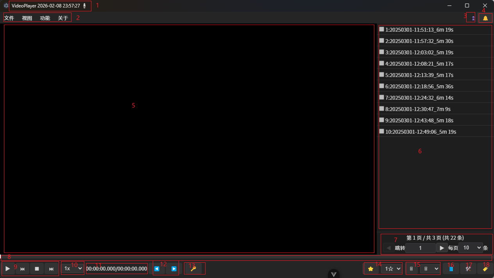
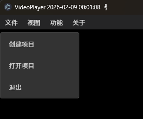
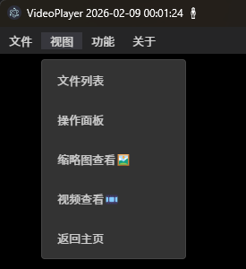
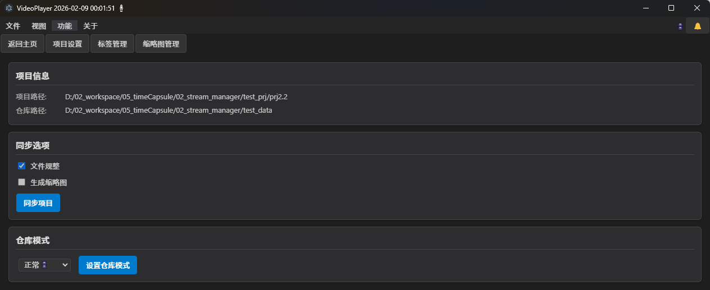

录像文件管理软件使用手册

# 1 简介

## 1.1 软件概述

录像文件管理软件（Record Manager）是一款专为安防监控视频文件管理而设计的桌面应用程序。该软件提供视频快速检索、智能分类管理、标签标注、关键帧提取与存储等核心功能。高度适合管理小米摄像头录像视频。也支持其他摄像头产生的录像文件。

## 1.2 设计目标

本系统旨在解决大规模录像数据管理中的常见挑战：
- 海量视频文件的高效组织与检索
- 有价值内容的快速识别与筛选
- 存储资源的优化利用
- 自动化视频处理与分析

## 1.3 核心功能

- **录像播放控制**：支持标准播放、变速播放、帧精确定位、关键帧预览
- **文件管理**：视频文件浏览、软删除（回收站机制）、批量操作
- **标注系统**：基于标签和分级的视频内容分类与标记
- **关键帧处理**：自动提取录像频关键帧、关键录像片段，减少存储空间占用

## 1.4 适用场景

- 安防监控录像的长期归档与管理
- 智能家居设备（如小米摄像头）录像的集中管理
- 支持标准命名格式的MP4视频文件（如：`00_20260208103944_20260208104539.mp4`）

# 2 系统要求与安装

## 2.1 系统兼容性

- Microsoft Windows 10 (64位)
- Microsoft Windows 11 (64位)

## 2.2 硬件要求

正常可运行的办公电脑即可。
- CPU：双核处理器，主频2.0GHz以上
- 内存：4GB RAM（推荐8GB）
- 存储：充足磁盘空间用于视频文件存储

## 2.3 安装步骤

系统采用绿色免安装部署模式，解压后即可运行。

## 2.4 首次启动配置

首次启动时无需额外配置，系统将自动创建默认项目。配置文件存储于项目目录中，支持项目重建功能。

# 3 快速入门

## 3.1 界面概览

- 1 **状态面板**：实时显示系统运行状态
- 2 **功能导航栏**：提供主要操作入口
- 3 **数据视图切换**：正常仓库/回收站，切换可以查看对应正常存储的录像，或者在回收站中的录像。某些时候  一些重要性低录像，可以被删除，但此时存储空间还有剩余，这样就可以先把录像文件放到回收站中，后续可以再找回，或者等待存储空间满时，再从回收站中删除部分录像文件，以此腾出存储空间。
- 4 **消息中心**：显示系统通知与操作反馈
- 5 **媒体预览区**：视频播放或缩略图网格显示，支持时间轴快速预览
- 6 **文件列表**：视频文件元数据展示
- 7 **分页控制器**：大数据集导航
- 8 **播放控制栏**：视频播放进度、关键信息显示
- 9 **播放控制按钮**：播放/暂停、停止等基础控制
- 10 **倍速调节**：播放速度控制
- 11 **时间显示**：当前播放时间/总时长
- 12 **逐帧导航**：精确帧定位
- 13 **关键帧提取**：提取当前播放位置的关键帧
- 14 **内容评级**：视频重要性分级标注
- 15 **文件删除**：支持软删除与硬删除操作
- 16 **视图切换**：文件列表视图切换
- 17 **编辑面板**：视频剪辑与处理功能入口
- 18 **标签管理**：视频内容标签化管理

## 3.2 创建/打开项目

项目创建需要配置视频存储仓库目录和项目工作目录。系统会缓存上次项目路径，支持自动重连。

创建项目后，需执行项目同步操作，将视频文件元数据导入数据库并生成预览资源。

## 3.3 切换视图

- **文件列表视图**：元数据表格显示
- **编辑面板**：视频剪辑工具集
- **视频播放视图**：标准播放器界面
- **缩略图视图**：关键帧网格预览，可以快速预览录像内容
- **主页**：返回文件管理主界面

## 3.4 标准操作流程

## 3.4 基本操作流程

1. **项目初始化**：创建新项目，配置视频存储路径和项目路径
2. **数据同步**：执行项目同步，将视频文件信息录入数据库，同时生成缩略图和录像关键帧数据
3. **内容管理**：返回主界面进行视频文件的浏览与管理
   
**数据删除策略**：
- 正常模式下删除：文件移至回收站，保留预览资源
- 回收站模式下删除：执行物理删除，可选择性清除预览资源

支持视频内容分级标注，便于后续批量处理与检索。

# 4 高级功能

## 4.1 视频剪辑功能

支持视频片段裁剪、合并、分割等非线性编辑操作，可移除冗余内容，保留关键片段。

## 4.2 智能压缩策略
针对低优先级视频文件，系统可执行关键帧抽取策略，在保留核心信息的同时显著降低存储占用。此类文件在列表中以特殊标识显示，仅支持预览模式。

## 4.3 批量处理
支持多选视频文件进行批量标注、删除、导出等操作，提升工作效率。

## 4.4 搜索与过滤
提供多维度搜索功能，支持按时间范围、文件大小、标签、评级等条件进行精确过滤。

# 7. 技术支持

## 7.1 开源项目
项目源码托管于 GitHub：`https://github.com/xutopia77/record_manager.git`

## 7.2 社区支持
如遇技术问题，请参考项目文档或提交 Issue。

# 8. 版本信息
当前版本：2.2.6
发布日期：2026年2月

---

*本文档最后更新于：2026年2月*

